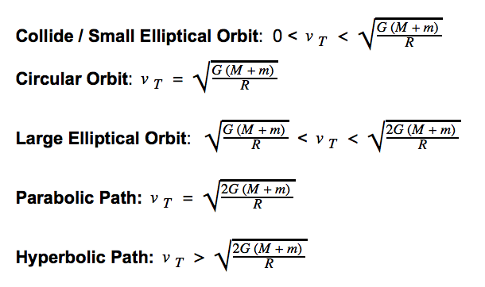

# Computational Methods Final Project
## Orbital Motion and Voyager 1 Trajectory
Meghan Cilento and Mairead Heiger

### Project Outline
The main goal of this project is to animate the trajectory of Voyager 1 as 
well as plot its energy as it travels out of the solar system. 

In order to generate the Voyager 1 path, we knew that we needed to first animate 
the orbits of Jupiter and Saturn, as well as produce a hyperbolic, or slingshot, 
orbit. We therefore began this project by plotting and animating different possible 
orbital trajectories. The purpose of these plots was to explore the initial conditions 
which produce such trajectories. Knowing the conditions which produce different 
types of orbits allowed us to set the initial conditions for Jupiter and Saturn's 
orbits, as well as for Voyager 1 as it approached the planets on its path. 

The python notebook, `Final Project Code.ipynb`, generates the plots and
animations for five different orbit types:

1. Collision Orbit
2. Circular Orbit
3. Large Elliptical Orbit
4. Parabolic Orbit
5. Hyperbolic Orbit

The condition which determined which orbit Jupiter would follow was the initial 
velocity. For all of these orbits, we kept the initial x-position constant at
x0 = 7.4052e11, which is the semi-major axis of Jupiter's known orbit. As you can 
see in the animations (all of which are saved as .mp4 files), changing the
initial velocity drastically changes which path Jupiter takes as it orbits the sun.

The chosen initial velocity values are not arbitrary. We knew that The tangential 
velocity of one object with respect to another determines whether the object 
collides with the other object, goes into orbit, or flies off into space. 
We used the following conditions to choose our initial velocity values: 

The following known values were used in our calculations:  
**M** (sun) =   
**m** (jupiter)=   
**G** (constant)=   
**r** (semi-major axis)= 

