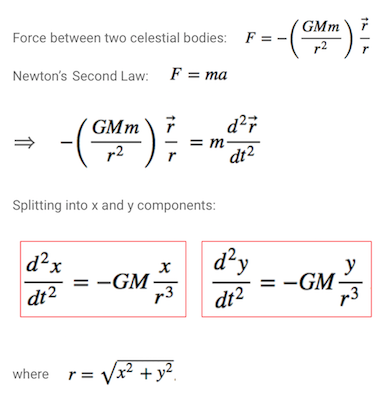

# Computational Methods Final Project
## Orbital Motion and Voyager 1 Trajectory
Meghan Cilento and Mairead Heiger

### Project Outline
The main goal of this project is to animate the trajectory of Voyager 1 as it
uses gravitational assists to travel out of our solar system. The following steps
outline the intermediate stages to getting to that final animation:

1. Calculate and animate different types of Keplerian orbits
2. Explore how different initial conditions affect slingshot trajectory
3. Calculate the trajectory of Voyager 1
4. Animate the trajectory of Voyager 1

#### **Part 1**
In order to generate the trajectory of Voyager 1, we knew that we needed to first 
animate the orbits of Earth, Jupiter and Saturn, as well as produce a hyperbolic, or 
slingshot, orbit. We therefore began this project by plotting and animating 
different possible Keplerian orbits to explore the initial conditions which produce 
such trajectories. 

The equations of motion for a planetary orbit are given by second order 
differential equations which can be derived from the force of gravitational
attraction between two celestial bodies:

The two second order ODEs outlined in red were solved using the 4th order Runga 
Kutta Method. This method was chosen over others because there is a minimal loss 
of energy during the timescale of Voyager 1's trajectory. It was also easy to code, 
and it is not an implicit method, so it was less computationally demanding. 

Using the solutions to these equations, we were able to set initial conditions
for position and velocity. Knowing that the tangential velocity of one object 
with respect to another determines whether the object collides, orbits, or flies 
off into space allowed us to generate the five different possible Keplerian orbits 
by adjusting the initial velocity condition. Our main focus of this project is 
on the hyperbolic orbit, which produces gravitational assists.

The python notebook, `Final Project Code.ipynb`, generates the plots and
animations for the five different orbit types:

1. Collision Orbit
2. Circular Orbit
3. Large Elliptical Orbit
4. Parabolic Orbit
5. Hyperbolic Orbit

In this notebook, we used Jupiter as an example planet. The equations for tangential
velocity condition extend to any two interacting objects, but in this case, we 
set Jupiter at its perihelion location (x0 = 7.4052e11) and gave it different initial 
tangential velocities to demonstrate how initial velocity affects final trajectory. 
As you can see in the animations (all of which are saved in `Orbit Animations`), 
changing the initial velocity drastically changes which path Jupiter takes as it 
orbits the sun.

The following equations provide the initial velocity constraints which determine
the final path an object will take when it starts moving tangentially to another
object.

The following known values were used in our calculations:  
**M** (sun) = 1.989e30 kg  
**m** (jupiter) = 1.898e27 kg      
**G** (constant) = 6.67408e-11 m^3 kg^-1 s^-2  
**r** (semi-major axis) = 7.4052e11 m

#### **Part 2**

A gravity assist (also called a slingshot) is a spacecraft maneuver that uses the relative motion between a planet and a spacecraft to accelerate the spacecraft. Gravity assists are most commonly used to change the direction or velocity of a spacecraft without using fuel. These maneuvers can be approximated as elastic collisions, in which the spacecraft "bounces" off the planet like one billiard ball bouncing off another. Because the planet is so massive compared to the spacecraft, the spacecraft can gain energy and accelerate while the planet loses a negligable amount of energy.

We calculate, plot, and animate several different sample slingshot trajectories, demonstrating several uses of slingshots, including positive acceleration of the spacecraft, reversal of direction, orbit, and negative acceleration.

We also made a GUI so that the reader can make their own gravity assist. It takes user input for initial conditions (initial position and velocity of planet and satellite) and returns a plot of the trajectory of the planet and satellite given those conditions.

The code uses a second order ODE that describes the motion of a satellite or probe in the presence of the planet, which we approximate as moving in a straight line at constant velocity (this is done more rigorously later). In this section, we use mock units. For example, an initial velocity might be three units per second, and the planet is 80 mass units / G, where G is the gravitational constant. These units allowed us to explore gravity assists without worrying about the huge distance scale on which gravity assists actually occur. 

#### **Part 3**
Voyager 1 does two gravity assists, first around Jupiter and then around Saturn, before exiting the solar system. Both assists are to gain speed and to change direction. The actual, historical trajectory of Voyager 1 (and 2) is pictured below:

We first calculated the position and velocity of Earth, Jupiter, and Saturn at every point in their orbit, and then modified the initial conditions (positions of planets) on the day of the launch to calculate Voyager's trajectory given those initial conditions. We also plotted the velocity of Voyager over time, and its velocity as a function of its distance from the Sun. These plots show the benefits and effects of the gravity assists clearly.

Because gravity assists are highly dependent on the initial positions of the planets, we were unable to replicate the exact trajectory of Voyager 1. However, our "Voyager 1" does complete flybys of both Jupiter and Saturn, with an additional flyby of Earth! With the correct initial positions of the planets (for which we would need accurate historical data), our Voyager 1 could have completed the historical trajectory.

The difficulty we had here speaks to the difficulty of gravity assists in general--rarely do planets align well enough to complete even simple gravity assists like Voyager 1, much less several like Voyager 2. More commonly, more complicated trajectories are necessary (like those of [Galileo](https://en.wikipedia.org/wiki/Gravity_assist#/media/File:Animation_of_Galileo_trajectory.gif) or [Rosetta](https://en.wikipedia.org/wiki/Gravity_assist#/media/File:Animation_of_Rosetta_trajectory.gif)).
